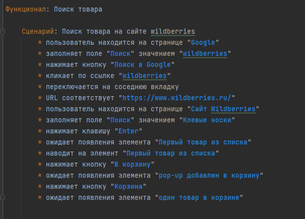

# WildberriesDemoTests

Это пример реализации автотестов с BDD подходом на примере магазина wildberries.

Главной особенностью такого подхода является написание тестов от пользовательских сценариев, а благодаря библиотеке PageFactory2 в которой уже предопределенны все часто используемые шаги, можно приступать к разработке тестов "на ходу" заполняя ключевые параметры своими значениями (локаторами): 

Используемые фреймворки:

Cucumber - фреймворк для BDD тестирования. Документация https://docs.cucumber.io/docs/cucumber/

Selenium - фреймворк для автоматизации UI приложений. Документация https://www.selenium.dev/documentation/overview/

PageFactory2 - фреймворк который расширяет возможности Cucumber, содержит множество уже готовых шагов. Документация https://docs.sbtqa.ru/?version=15.9.3#

